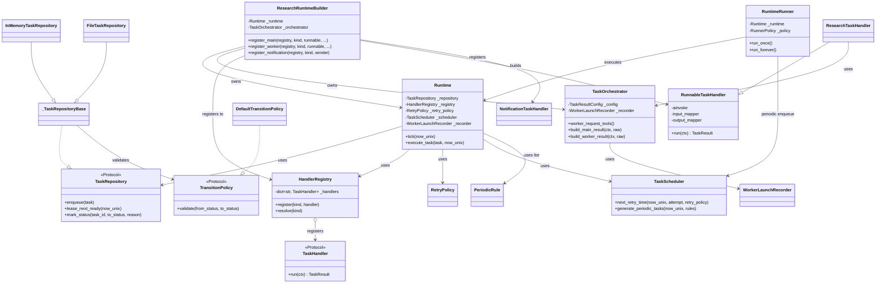

# README
`uv pip install -e .`

`uv sync --extra examples`

`ruff check .`

`pyright .`

## trace
https://us.cloud.langfuse.com/project/cmmpuv8g0040dad07ihyem6vp/traces?peek=a998fe8525ebaa600a819b80a3c5cacd&timestamp=2026-03-14T06%3A04%3A12.008Z

## Runtime クラス関係図（`src/runtime_core/runtime`, `src/runtime_langchain`）

